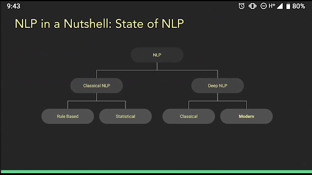

# Week 1 (Introductions!)

## What do you do at Uncharted? How do you plan to use NLP?

(stuff here! Ask Danielle for complete notes)

Goals: We are working towards mapping text to high-level categories.

Challenges: Scaling curation of categories is difficult across specific domains.

## Overview of [Sota Video](https://www.youtube.com/watch?v=YxMW0w7ojek&feature=emb_logo):

* 2nd deep learning surge
  * Linguistic Self Informed Arch
  * ELMo
  * Transformer architecture (apparently kind of like LSTMs or Gated RNNs)   https://jalammar.github.io/illustrated-transformer/
    * BERT
    * GPT-2
    * XL-Net
* A lot of the above architectures emphasize attention. Part of NLP is paying attention to a large enough window of signal. It's considered a substantial bottleneck.
* High Level Tasks:
  * Things a human thinks about -> translation, answering a question
* Lowl Level Tasks:
  * Things a human doesn’t think about -> POS
* Rule Based
  * Finite State Automata
  * WordNet
  * Parse Trees
* Statistical NLP
  * Relied heavily on co-occurrence
  * Also HMM: POS taggers
  * MFS - Most Frequent Sense
* First NLP surge

